<div align="center">

# Questline

Map your operating model as a skill tree

[![Live][badge-site]][url-site]
[![HTML5][badge-html]][url-html]
[![CSS3][badge-css]][url-css]
[![JavaScript][badge-js]][url-js]
[![Claude Code][badge-claude]][url-claude]
[![License][badge-license]](LICENSE)

[badge-site]:    https://img.shields.io/badge/live_site-0063e5?style=for-the-badge&logo=googlechrome&logoColor=white
[badge-html]:    https://img.shields.io/badge/HTML5-E34F26?style=for-the-badge&logo=html5&logoColor=white
[badge-css]:     https://img.shields.io/badge/CSS3-1572B6?style=for-the-badge&logo=css3&logoColor=white
[badge-js]:      https://img.shields.io/badge/JavaScript-F7DF1E?style=for-the-badge&logo=javascript&logoColor=black
[badge-claude]:  https://img.shields.io/badge/Claude_Code-CC785C?style=for-the-badge&logo=anthropic&logoColor=white
[badge-license]: https://img.shields.io/badge/license-MIT-404040?style=for-the-badge

[url-site]:   https://questline.neorgon.com/
[url-html]:   #
[url-css]:    #
[url-js]:     #
[url-claude]: https://claude.ai/code

</div>

---

## Overview

Questline turns a roadmap and prioritization operating model into a video-game console. A NieR-style interface with tabbed sections, master and detail panels, and a hold-Esc quick menu lets people onboard by exploring instead of reading a wall of text. A Detroit-style chapter flowchart shows the unlock map. Progress saves on the device.

**Live:** questline.neorgon.com

---

## Console sections

- **Brief** -- a featured news hero, rank, the six key shifts, and the ceremonies, at a glance
- **Chapters** -- master/detail list of the seven onboarding chapters with skill toggles
- **Priority** -- priority bands, the ranked initiative list, and your rank ladder
- **Intel** -- a searchable field glossary of every key term, master/detail
- **Flow** -- a living chapter map that reveals as you clear work; click any node to focus its local plan
- **System** -- save management, toggles for the title screen, keyboard controls, and the Flow map reveal, an about panel, and a hidden friend

---

## Chapters

- **Foundations** -- why the model exists and what changes
- **Define the Work** -- specs, owners, and planning inputs
- **Prioritize** -- one ranked backlog with priority bands
- **Ship & Inspect** -- continuous delivery on a regular cadence
- **Ceremonies** -- the recurring forums that keep work moving
- **Track & Estimate** -- tracker, story points, and traceability
- **Milestones** -- the key dates and the move to make now

---

## Features

- **Game console interface** -- NieR-style tab bar, ghosted titles, master/detail panels, and a bottom key-hint bar that reflects the real working keys
- **Featured news hero** -- one large, catchy banner on the home screen with a big optional image (a layered gradient stands in when none is set); it slow-rotates every ten seconds, with dots to jump, and opens the full story in the focused reading popup
- **Focused reading popup** -- longer copy opens on a calm, near-black panel with the azure faceted frame, so reading happens away from the busy console; a banner or the six-shifts briefing both land here
- **Six shifts, one read** -- the six key shifts collapse to a single read-check and a "Read the shifts" button that opens them all in the focused reader
- **Searchable glossary** -- the Intel codex is fully open; a search box filters terms as you type, and pressing `/` anywhere jumps to it as a quick-navigation shortcut. Selecting a term updates only the detail panel, so the list keeps its place
- **Boot splash** -- an optional title screen pauses on a "press any key to continue" beat before the console floods in; shows once, then a System toggle can bring it back every visit
- **Full keyboard control** -- arrow keys move a cursor through lists, skills, and the map; `Enter` opens or toggles; hold `Enter` clears a chapter; `Q`/`E` cycle the tabs. A System toggle turns keyboard movement off for mouse-only use, and the hint bar follows it
- **Quick menu** -- hold `Esc`, point with the arrow keys or mouse, release to jump to Brief, Chapters, Priority, or Flow
- **First-run coach** -- a one-time card teaches the keyboard model and quick menu, then never shows again
- **Reveal-as-you-go map** -- the Flow map starts in fog and grows as you clear chapters; locked future chapters stay hidden until you unlock them, then ease into view. A System toggle switches to a full map that shows the whole path at once, with locked chapters dimmed, for learners who want the overview first
- **Plain-language tab tooltips** -- each game-styled tab carries a tooltip and screen-reader gloss (Intel is the field glossary, Flow is the chapter map) so its purpose is discoverable
- **Focus a chapter** -- click any node on the map to focus its local plan: what it requires above, what it unlocks below, and a preview of its skills
- **Jargon tooltips** -- glossary terms in the copy are underlined; hover or focus one for a definition popover, click to open it in Intel
- **Complete in one move** -- a master toggle in the chapter header marks every skill done and stamps a cleared seal; on hover it zooms slightly and a glow sweeps across it; clearing it again asks first
- **Game-feel rewards** -- a rank-up plate on each threshold, an XP count-up on the progress bar, and a toast on each chapter cleared
- **Soft strategy-UI motion** -- views settle in with a staggered, exponential ease when you navigate, while in-tab cursor moves stay perfectly still
- **Considered reset** -- a quiet link, not a loud button; clicking it tints the screen corners red and asks first, then offers an Undo right after
- **Progress that sticks** -- completed skills and rank persist in localStorage
- **Rank ladder** -- climb from Recruit to Architect as you clear chapters
- **Modern Disney theme** -- deep navy with one azure accent and gold, readable sans throughout, with fully closed faceted panels
- **Easter egg** -- a kiwi is hiding in System

---

## Keyboard

- **`↑` / `↓`** -- move the cursor through the chapter list, the skills in a chapter, or the map nodes
- **`Enter`** -- open the cursored chapter, or toggle the cursored skill; **hold `Enter`** in a chapter to mark it complete
- **`←` / `Backspace`** -- step from a chapter's skills back to the chapter list
- **`Q` / `E`** -- cycle the console tabs
- **`/`** -- jump to the Intel glossary and focus its search box, from anywhere
- **Hold `Esc`** -- open the quick menu; point with arrows or mouse, release to jump
- **Tap `Esc`** -- step back to the Brief

Keyboard movement can be switched off in **System** (the `/` search shortcut, the quick menu, and all mouse control still work).

---

## Running locally

ES modules require an HTTP server (not `file://`):

```bash
python3 -m http.server 8832
```

Then open http://localhost:8832/.

---

## Architecture



```
questline-site/
├── index.html          # App shell + quick-menu overlay + SEO head + JSON-LD
├── css/
│   ├── style.css       # Manifest: @imports the parts in cascade order
│   └── parts/
│       ├── base.css        # Reset, design tokens, layout, header, nav/auth, buttons
│       ├── components.css  # Overlays (modal, reader, splash, coach), toast, closed-bevel ring
│       ├── flow.css        # Detroit-style chapter flowchart (Flow tab graph)
│       └── console.css     # NieR console: tabs, panels, every tab view, controls
├── js/
│   ├── app.js          # Entry point — wires modules together
│   ├── data.js         # Chapters, skills, tabs, glossary, ranks, banners (the content model)
│   ├── state.js        # Hash routing, progress + unlock logic, flow reveal/focus, cursor + search state, prefs (questline-prefs)
│   ├── console.js      # NieR-style console tabs (Brief, Chapters, Priority, Intel, System); icon() resolves both icon sets
│   ├── icons-fa.js     # Filled FontAwesome-style icon set, rendered with currentColor (extracted from svgs/)
│   ├── banners.js      # Home news hero (markup + slow-rotate controller) and the six-shifts reader content
│   ├── flow.js         # The Flow tab: reveal-as-you-go full map + click-to-focus local map
│   ├── render.js       # View dispatcher, entrance motion, banner mount, flow SVG connector wires
│   ├── keynav.js       # Keyboard cursor: arrows, Enter, hold-Enter, Q/E tabs, / search; honors the System opt-out
│   ├── quickmenu.js    # Hold-Esc radial shortcut overlay
│   ├── splash.js       # Boot splash (press any key); once-then-remembered, System-toggleable
│   ├── coach.js        # First-run coach-mark (teaches the keyboard + quick menu)
│   ├── glossary.js     # Jargon term tooltips for glossary terms in the copy
│   ├── celebrate.js    # Rank-up plate, XP count-up, chapter-cleared toast
│   ├── modal.js        # Confirm dialog + focused reading popup (openConfirm, openReader), shared focus trap
│   ├── kiwi.js         # The hidden kiwi easter egg
│   ├── events.js       # Routing, delegated clicks, skill toggles, Intel search + surgical detail patch, reset+undo, prefs toggles
│   └── utils.js        # escHtml, toast, action toast, helpers
├── svgs/               # Source SVG icons (extracted into js/icons-fa.js)
├── docs/
│   └── architecture.svg
├── CNAME               # questline.neorgon.com
├── robots.txt
└── sitemap.xml
```

---

<div align="center">
<sub>Part of <a href="https://neorgon.com/">Neorgon</a></sub>
</div>
